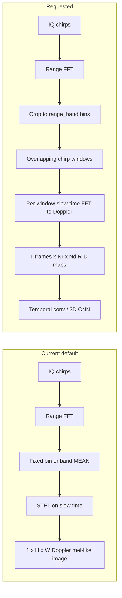

# Range–Doppler sequences, band focus, val falls, fall-weighted loss

## Current vs desired signal

Today, `[slow_time_at_range](radar_cnn/spectrogram.py)` **collapses** the band to one complex slow-time series (`mean` over bins in `band` mode). You want to **keep** range resolution within the band and form **true range–Doppler** tiles per time window, then stack **10–20** such maps along time so the net can learn **implicit** dynamics (including acceleration-like motion) without IMU.

**Acceleration:** There is **no** acceleration channel in the Glasgow `.dat` pipeline today; optional X-IMU in some studies is documented as a separate modality in `[Chuy/04_nn_inputs_exclusions.md](Chuy/04_nn_inputs_exclusions.md)`. Your choice to use **only** learned temporal R–D sequences is consistent with pure-radar training.

---

## 1. Preprocessing: range–Doppler sequence

**Add** a new mode in `[SpectrogramConfig](radar_cnn/spectrogram.py)` (e.g. `representation: doppler_mel | rd_sequence`) or a parallel config block `rd_sequence:` to avoid breaking existing runs.

**Per clip (one `.dat`):**

1. Load IQ → `(num_chirps, Ns)` as today (`[read_glasgow_dat](radar_cnn/io_dat.py)`).
2. Range FFT along fast time → `(num_chirps, Nb)` (reuse `[range_fft_positive](radar_cnn/spectrogram.py)`).
3. **Crop** to `range_band` `[b0, b1]` → `(num_chirps, Nr)` with `Nr = b1 - b0 + 1` (no mean across range).
4. Split slow time (chirp index) into frames:
  - `rd_chirps_per_frame`: chirps per R–D map (hyperparameter).
  - `rd_frame_hop`: step between consecutive frames (hyperparameter). **Overlap** = `rd_chirps_per_frame - rd_frame_hop` when `hop < chirps_per_frame`.
5. For each frame: take complex array `(rd_chirps_per_frame, Nr)`, apply window along chirp axis, **FFT along chirps** → Doppler axis `Nd` (size = next power of two or fixed `rd_doppler_bins`).
6. Log-magnitude: `log(|RD| + eps)`, optional resize of `(Nr, Nd)` to fixed `(rd_height, rd_width)` for a stable tensor size.
7. Stack **T** frames (target **10–20**): if fewer frames after cropping/padding slow time, **center-crop or pad** the chirp sequence to match `[fixed_num_chirps](configs/default.yaml)` semantics, or define `min_frames` / pad with zeros.

**Config additions** (names illustrative): `representation`, `range_bin_mode: band` (required for meaningful `range_band`), `rd_chirps_per_frame`, `rd_frame_hop`, `num_rd_frames` (or derive T from length), `rd_height`, `rd_width`, `rd_doppler_bins` / FFT size.

**Cache key** in `[_cache_key](radar_cnn/dataset.py)` must include all new fields so caches stay valid.

---

## 2. Dataset and normalization

- `[RadarSpectrogramDataset](radar_cnn/dataset.py)`: `_load_spec` returns array shaped `(T, H, W)` or `(T, Nr, Nd)`; `__getitem__` stacks channels as `**(1, T, H, W)`** for 3D conv **or** `(T, 1, H, W)` depending on model API.
- `[compute_train_statistics](radar_cnn/dataset.py)`: extend to compute global mean/std over **sequence tensors** (same as now but over an extra time dimension), or per-frame then same normalization.

---

## 3. Model

- Replace or add alongside `[SmallRadarCNN](radar_cnn/model.py)`: e.g. `**SmallRadarCNN3D`** with `Conv3d` stem / blocks, or **2D CNN per frame + temporal pooling** (mean over T, or attention), or **(2+1)D** factorized convolutions. Start with a **small 3D CNN** on `(C=1, T, H, W)` to match “sequence of maps” directly.
- `[evaluate.py](radar_cnn/evaluate.py)`, `[train.py](radar_cnn/train.py)`, `[loso.py](radar_cnn/loso.py)`: instantiate the matching architecture; checkpoint stores `model_type` / `representation` for reload.

---

## 4. Validation set: ensure falls present

Subject-only split (`[subject_train_val_test](radar_cnn/splits.py)`) can place **all** subjects with fall recordings in train by chance, leaving **zero fall files in val**.

**Approach:** **Fall-aware subject assignment** (minimal viable):

- Build `subject -> set(activity codes)` from filenames (`[parse_filename](radar_cnn/labels.py)`).
- Partition subjects into those with **at least one fall** (`A06`) vs without.
- Shuffle within each group, allocate val/test slots so **val contains at least `min_val_fall_files` (e.g. 1)** fall clips **or** at least one fall subject—exact rule as a hyperparameter.
- If impossible (e.g. too few fall subjects), **raise a clear error** listing counts and suggesting smaller train fraction or different seed.

Log at train start: **fall counts per split** (files and subjects).

---

## 5. Penalize fall errors more

- In `[train.py](radar_cnn/train.py)`, after existing inverse-frequency weights (`[class_weights_from_train](radar_cnn/train.py)`), multiply the weight for **fall** (class index **5**, activity 6) by `training.fall_loss_multiplier` (e.g. `1.5`–`3.0`, default `1.0` for backward compatibility).
- Document that this **does not** fix rare fall in val if falls are absent; it only reweights the loss.

---

## 6. Config and docs

- Update `[configs/default.yaml](configs/default.yaml)` with `representation`, `rd_`* hyperparameters, `fall_loss_multiplier`, `min_val_fall_files` (or similar), and switch default `range_bin_mode` to `**band`** when using R–D sequence.
- Update `[radar_cnn/README.md](radar_cnn/README.md)`: describe R–D sequence input, overlap tuning, fall-aware split, and fall loss multiplier.

---

## 7. Risk / scope notes

- **Compute and memory:** Sequences of R–D maps are heavier than a single 128×128 mel-like image; batch size may need to drop.
- **Backward compatibility:** Keep the old `doppler_mel` (current) path so prior checkpoints and ablations still run.
- **STFT overlap** (`stft_noverlap`): only applies to the **old** representation; the new path uses `**rd_frame_hop` / `rd_chirps_per_frame`** for temporal overlap between R–D frames.

