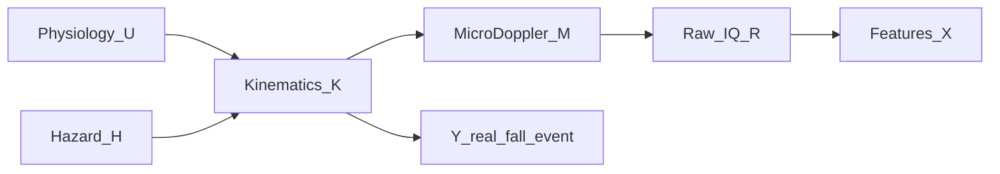
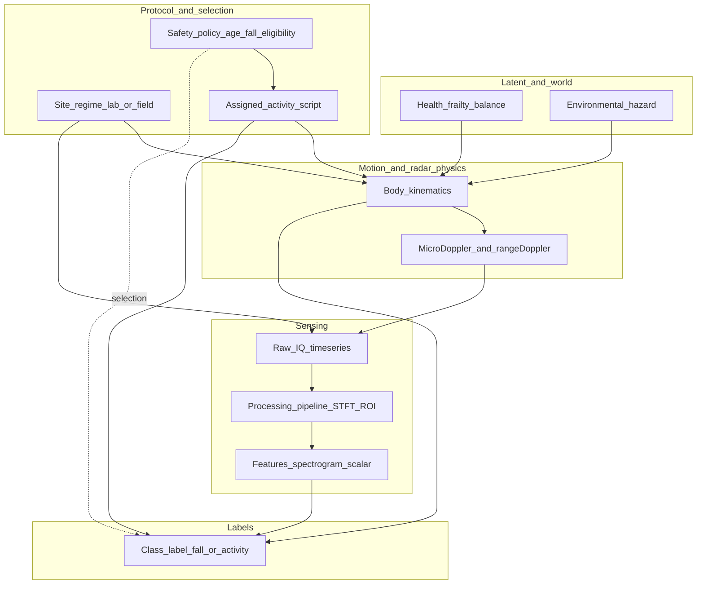

# Causal graph — fall phenomena vs. radar observations (Pearl-style)

This document uses **directed acyclic graphs (DAGs)** and Judea Pearl’s **intervention (`do`)** language to separate:

1. **Latent** processes (balance, intent, real-world hazard).
2. **Experimental protocol** (what participants were asked to do, where, and who may perform falls).
3. **Measurement** (FMCW IQ → images / features).
4. **Labels** in the corpus (activity codes, fall vs non-fall).

It builds on [`01_dataset_inventory.md`](01_dataset_inventory.md) and [`02_literature_synthesis.md`](02_literature_synthesis.md).

## Phenomenon DAG vs experimental DAG

These are **related but not identical**. The distinction matters because the **dataset** is generated by an **experiment**, not by **random sampling** of real-world falls.

### 1. Phenomenon DAG (target of inference)

This is the structure you ultimately care about for **real** falls in the wild:

- **Causes of motion:** physiology and environment drive **natural kinematics** \(K\).
- **No assigned-activity node:** there is **no** \(A\) from a protocol; falls **arise** from instability, hazard, etc.
- **Radar chain:** \(K \rightarrow M \rightarrow R \rightarrow X\) as before.
- **Outcome:** \(Y_{\text{real}}\) is a **physical fall event** (loss of balance, impact, etc.), not “which script was run.”

Conceptually:

\[
U, H \rightarrow K \rightarrow M \rightarrow R \rightarrow X, \qquad K \rightarrow Y_{\text{real}}
\]

where \(U\) is frailty/balance, \(H\) is hazard (slip, obstacle). **Falls are not assigned**; they are **events** in this graph.

### 2. Experimental DAG (what you actually train on)

The **corpus** is produced by **protocol decisions**: assignment \(A\), eligibility \(E_{\text{age}}\), site \(S\), and processing \(P\). The refined figure in the next section is this **experimental / measurement** DAG—the **data-generating process of the dataset**.

\[
E_{\text{age}} \rightarrow A \rightarrow K \rightarrow M \rightarrow R \rightarrow X, \qquad A \rightarrow Y
\]

Here **\(A\)** (**assigned activity**) **replaces** natural causes of “which motion occurs”; **\(Y\)** in the files is **constructed from the script**, not observed as an independent adjudication of a wild fall. Selection distorts **who** contributes which labels.

### 3. Why the two graphs must be separate

**(a) Cause of falls**

- **Real world:** \(U, H \rightarrow K \rightarrow Y_{\text{real}}\).
- **Dataset:** \(A \rightarrow K \rightarrow Y\) (label tied to **instruction**).

The model fits **how people perform a fall when instructed**, not necessarily **how falls emerge** from instability and hazard.

**(b) Label semantics**

- **\(Y_{\text{real}}\):** physical event.
- **Dataset \(Y\):** **which recording script** was executed—**a different variable** co-named “fall” in code.

### 4. Which graph this document emphasizes (and why that is correct)

The **refined DAG below** is the **experimental** one. That is what you need to:

- detect **leakage** and **selection bias**;
- decide **NN inputs** ([`04_nn_inputs_exclusions.md`](04_nn_inputs_exclusions.md)).

A graph with **only** the phenomenon would **miss** age-based censoring, assignment leakage, site effects, and **\(do(P)\)**. So: **do not replace** the experimental DAG with the phenomenon DAG for **training-set reasoning**—use **both**, for **different questions**.

### 5. Connecting the two (transportability)

Schematically:

\[
\text{Phenomenon DAG} \xrightarrow{\text{interventions } (A),\ \text{selection } (E_{\text{age}}, S),\ \text{processing } (P)} \text{Experimental DAG}.
\]

The experiment **substitutes** \((U,H)\)-driven behavior with **scripted control** \(A\), **filters** who performs which activity, and **transforms** echoes via \(P\). Aligning **\(P_{\text{exp}}(Y \mid X)\)** with **\(P_{\text{real}}(Y \mid X)\)** is Pearl’s **transportability** problem: **\(P_{\text{exp}}(K)\)** is driven by \(A\), while **\(P_{\text{real}}(K)\)** is driven by \(U, H\).

### 6. Practical implication

A neural network is trained on **\(P_{\text{exp}}(Y \mid X)\)** (distribution induced by the study). Deployment often targets **\(P_{\text{real}}(Y \mid X)\)**. They **differ** because the **experimental** graph is a **biased, intervened, selected** projection of reality—not because the phenomenon DAG is “wrong,” but because **data are not** a random draw from it.

**Bottom line:** Keep the **experimental** DAG for **what the model actually learns**. Use the **phenomenon** DAG to state **what you wish** to generalize to and to **scope claims**.

---

## Variables (informal SCM)

| Symbol | Meaning |
|--------|---------|
| \(U\) | **Latent health / frailty / balance** (not in `.dat`). |
| \(H\) | **Environmental hazard** in the wild (wet floor, obstacle) — largely **absent** in lab scripts. |
| \(S\) | **Protocol regime**: lab vs NG Homes vs West Cumbria; room layout; mat; spotters ([`Readme.txt`](Readme.txt), volunteer sheet). |
| \(E_{\text{age}}\) | **Eligibility rule** for scripted fall (safety) — induces **selection** on who has fall labels ([`Radar-based human activity recognition.txt`](Radar-based%20human%20activity%20recognition.txt)). |
| \(A\) | **Assigned activity script** (walk, sit, …, **scripted fall**) — **intervention** by experimenters. |
| \(K\) | **Kinematics** (trajectories, velocities, micro-motion). |
| \(M\) | **Micro-Doppler / range–Doppler** phenomenon in echo physics. |
| \(R\) | **Raw IQ** time series in a file. |
| \(P\) | **Processing pipeline** (MTI, STFT, ROI thresholding, spectrogram) — **algorithm intervention** \(do(P)\) ([`Radar-based human activity recognition.txt`](Radar-based%20human%20activity%20recognition.txt)). |
| \(X\) | **Features** fed to a classifier (pixels, max velocity, engineered vectors). |
| \(Y\) | **Label** (activity class or fall vs non-fall). |

**Causal ordering (high level):**

- \(U, H \rightarrow K\) (physiology and world affect motion).
- \(S \rightarrow K\) (room, mat, instructions shape feasible motions).
- \(E_{\text{age}} \rightarrow A\) (who is **offered** the fall task) and **selection** on observed fall examples.
- \(A \rightarrow K\) **strongly** in the dataset: motion is **performed to satisfy the script**.
- \(K \rightarrow M \rightarrow R\) through radar physics and electronics.
- \(R \rightarrow X\) **only through** \(P\) (processing). So \(X = f_P(R)\).
- \(A \rightarrow Y\) **by construction** (labels come from **which script was run**), and \(K \rightarrow Y\) because scripts produce different motion.

## Refined DAG — **experimental / measurement** (dataset DGP)

**Dashed edge:** \(E_{\text{age}}\) **selects** which participants contribute fall examples; this is a **selection / censoring** mechanism on the fall **subsampling**, not a direct radar measurement.

## `do`-calculus style reading

- **`do(A = \text{fall script})`:** In the lab, a fall is **not** sampled from the natural distribution of falls in daily life. It is a **tripped / forward fall on a mat** at controlled speed ([`Information Sheet for Volunteers.txt`](Information%20Sheet%20for%20Volunteers.txt)). Any classifier learns **P(Y | X)** under the **empirical distribution of interventions** that produced the corpus — **transportability** to spontaneous falls is not guaranteed (Pearl’s **transportability** / **domain shift**).

- **`do(P = p_{\text{Li2023}})`:** Papers fix a **specific preprocessing** (filters, STFT length, ROI threshold). Changing \(P\) changes \(X\) **holding physics constant**. A neural net trained on \(X\) is tied to **`do(P)`** unless raw IQ is used and \(P\) is varied or made **causally minimal** (physics-based invariants).

- **Observational vs interventional inputs:** Filename codes **implement** \(A\) and **duplicate** \(Y\). Feeding them to the net is not “causal learning” of falls; it is **reading the assignment** (see [`04_nn_inputs_exclusions.md`](04_nn_inputs_exclusions.md)).

## Selection diagram (conceptual)

For **fall vs non-fall**, older participants **lack** fall trials **by design**:

- **Selection** on \((E_{\text{age}}, A)\) implies **fall class and age are dependent** in the dataset even if, in the wild, **age and fall risk** relate differently.
- **Observed age** is a **proxy** for \(E_{\text{age}}\): it lies on the path **Age \(\rightarrow E_{\text{age}} \rightarrow A \rightarrow Y\)**. That is **protocol-to-label** structure, not **kinematics \(\rightarrow\) radar \(\rightarrow\) fall**. Feeding age into a classifier therefore risks **selection-induced leakage** (high in-distribution accuracy, low validity for “radar evidence of fall”). See Section 4 of [`04_nn_inputs_exclusions.md`](04_nn_inputs_exclusions.md).

A **selection diagram** would add a **selection node** \(S_{\text{fall}}\) pointing to inclusion of fall clips; **Pearl: conditioning** on colliders can open paths — motivates **careful splits** (e.g. subject-wise) and explicit **missingness** modeling.

## What this graph does *not* claim

- The **refined figure** is **not** a complete model of **\(Y_{\text{real}}\)** in the wild; it models **\(Y\)** as **dataset label** (see [Phenomenon DAG vs experimental DAG](#phenomenon-dag-vs-experimental-dag)).
- It does **not** identify a **unique** SCM for “true fall” in free living — **\(H\)** is under-represented.
- It does **not** replace domain expertise on **radar electromagnetics**; \(M\) is a simplified abstraction.

## Practical takeaway

- **Phenomenon story (goal):** informative variation for real falls should ultimately come through **\(K \rightarrow M \rightarrow R \rightarrow X\)** with **\(U, H \rightarrow K\)**. The experiment **replaces** much of that with **\(A \rightarrow K\)**.
- **Experimental story (what you fit):** **\(P_{\text{exp}}(Y \mid X)\)** is what the NN sees; claims about **\(P_{\text{real}}(Y \mid X)\)** require **transportability** reasoning, not assuming the corpus is i.i.d. from the phenomenon DAG.
- **Non-transferable** artifacts flow **\(S, A, P\) \rightarrow X\)** or **\(A \rightarrow Y\)** directly — **exclude or control** them when claiming **generalizable** fall detection.
- **Selection-induced leakage** extends beyond filename and age: **site**, **session**, **subject identity**, **repetition ordering**, **scripted fall type**, **ROI/thresholding**, and **structured missingness** can all make **non-physics** variables predictive of \(Y\) because they co-vary with **which labels exist**. See Section 5 of [`04_nn_inputs_exclusions.md`](04_nn_inputs_exclusions.md).
